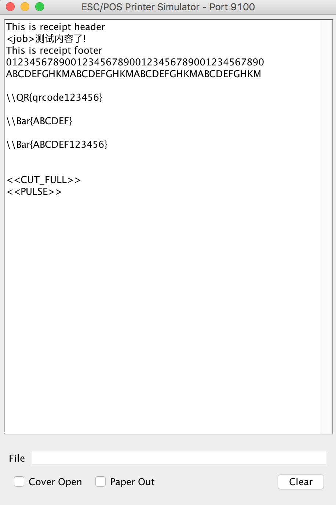
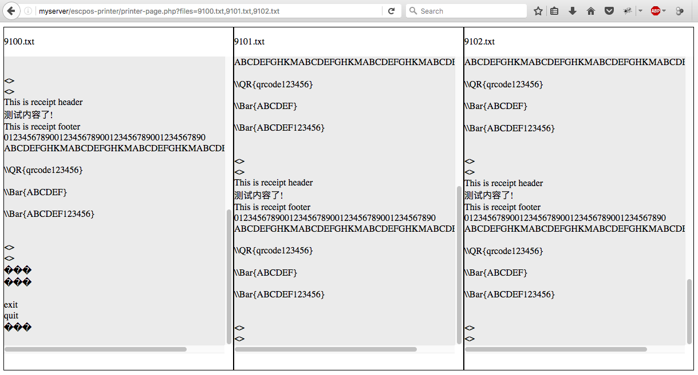

# escpos-printer-simulator
ESC/POS Printer simulator written in Java.  
This provide Swing GUI to display receipts and also write content to a file - access through web url.  
The idea comes from JavaPos printer simulator and from [escpos-tools](https://github.com/receipt-print-hq/escpos-tools), a PHP library.  
   

Web access:
   
## Usage
```
java -jar ESCPosPrinterSimulator.jar [port] [filepath] [filesize]

Example:
java -jar ESCPosPrinterSimulator.jar
java -jar ESCPosPrinterSimulator.jar 9100
java -jar ESCPosPrinterSimulator.jar 9100 receipts.txt 10

run as linux / ubuntu background:
java -jar ESCPosPrinterSimulator.jar 9100 receipts.txt 200 & exit
```
Arguments:
- port: optional - default 9100.  
- filepath: path to the written receipt - if available, program will run without GUI.  
- filesize: in KB - default 200. If reach the size, file will be deleted then recreated.  

Deploy on linux Apache & PHP 
```
java -jar ESCPosPrinterSimulator.jar 9100 /var/www/html/escpos-printer/tmp/9100.txt & exit  

access through url:  
http://{ip}/escpos-printer/printer-page.php?files=9100.txt  
```